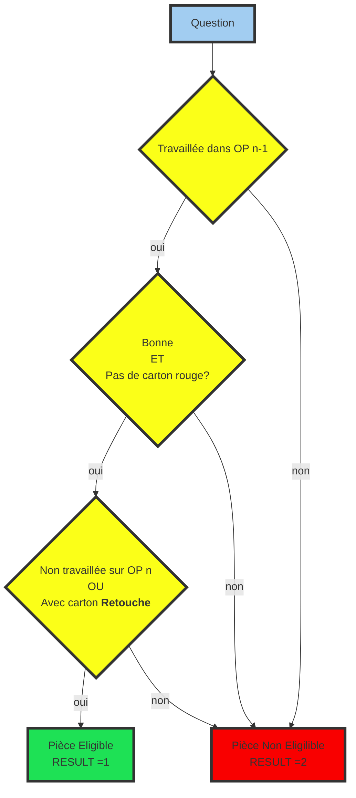

---
order: 2
icon: square-root-variable
title: Equations Eligibilité
date: 2022-06-20
category:
  - Guide
tag:
  - Programmation
  - Eligibilité
  
article: false

---

Pour répondre à chaque question d'éligibilité envoyée par la manutention sur la ligne, vous allez devoir créer des fonctions contenant une équation répondant au besoin qualité; ceci permettant de dire à la manutention si la pièce est eligible à être usiné à l'opération suivante.


Après avoir ajouté la fonction dans l'interface de création des équations, vous appuyerez sur l'icone ***modifier*** :memo:

![equationAjoutMySql][01]

La **fonction générée** renvoit par défaut la valeur 0 à la machine. Maintenant il va falloir programmer le résultat:
- 1 : Pièce Bonne
- 2 : Pièce Mauvaise

Vous pouvez choisir les **conditions** de résultats mais je vous aide un peu :tada: :clap: :sunglasses:  et vous donne les conditions définies sur **ETECH** et **EPT**

``` sql
-- Creation de la fonction SQL de nom T10_numeroOP
CREATE DEFINER=`pti_etec`@`%` FUNCTION `T10_00020`( 
    _MAPVER 	VARCHAR(  2 )	,
	_LIGNE 		VARCHAR(  1 )	,
	_OP 		VARCHAR(  5 )	,
    _REF		VARCHAR( 10 ) 	,
    _TYP		VARCHAR(  6 )  	,
    _VAR		VARCHAR(  2 )  	,
    _AN			VARCHAR(  2 )  	,
    _QUA		VARCHAR(  3 )  	,
    _SERIE 		VARCHAR(  5 )  	,
    _STA 		VARCHAR(  2 )  	,
    _BRO 		VARCHAR(  1 )  	,
    _MON 		VARCHAR(  1 )  	,
    _PKEY 		VARCHAR( 35 ) 			    

) RETURNS varchar(1) CHARSET utf8mb3 COLLATE utf8_bin
-- Cette Fonction est générée automatiquement par l'interface NE PAS MODIFIER!!!!!

BEGIN
-- RESULT contiendra la réponse à la question éligibilité	
DECLARE RESULT VARCHAR(1) DEFAULT '0' ;
-- SI La pièce dont le datamatrix est _PKEY est passé dans les OPS précedent	
   SELECT IF ((  PTI_ARE_OPS_WORKED('00010',_PKEY) AND 
-- ET QUE Le resultat de cycle est "OK" sur chaque OP
                ((PTI_OP_RESULT('00008',_PKEY) OR (PTI_GET_VAR('00008',_PKEY,8)&1 = 1)) AND((PTI_GET_VAR('00008',_PKEY,8)& 128 = 0))) AND
                ((PTI_OP_RESULT('00010',_PKEY) OR (PTI_GET_VAR('00010',_PKEY,8)&1 = 1)) AND((PTI_GET_VAR('00010',_PKEY,8)& 128 = 0))) AND
-- ET que la pièce n'est pas encore passé dans l'OP suivant  OU que l'utilisateur a signé la pièce en retouche sur l'OP suivant
                (NOT(PTI_IS_OP_WORKED('00020',_PKEY)) OR (PTI_GET_VAR('00020',_PKEY,8)&8 = 8))
                ) ,'1', '2') INTO RESULT ;
RETURN RESULT ;
	
END
```

BON!!! Pas si simple 	:dizzy_face: :exploding_head: :unamused: . ALLEZ Courage!!! On va essayer de décortiquer tout çà . 

Avant tout, je vous conseille d'apprendre un peu le langage [SQL][08]. 

:::info
Les lignes 1 à 21, on y touche pas. C'est la déclaration de la fonction SQL. Elle porte le nom que nous avons donné lors de la création
:::

Le **but de la fonction** :  retourner un résultat dans la variable **RESULT** 
  >- 1 = Pièce éligible
  >- 2 = Pièce non éligible

Nous avons créé des fonctions utiles pour faciliter la programmation :
>- PTI_ARE_OPS_WORKED
>- PTI_IS_OP_WORKED
>- PTI_OP_RESULT
>- PTI_GET_VAR

#### PTI_ARE_OPS_WORKED(`<numero d'opération>`,`_PKEY`)
Elle permet de savoir si la pièce avec le datamatrix `_PKEY` est passé dans toutes les opérations précédentes. Si oui la réponse est `true` Sinon `false`. La fonction se base sur la table `list_op` construite auparavant dans la base de donnée.  

#### PTI_IS_OP_WORKED(`<numero d'opération>`,`_PKEY`)
Elle permet de savoir si la pièce avec le datamatrix `_PKEY` est passé dans l'opération `<numero d'opération>` . Si oui la réponse est `true` Sinon `false`. La fonction se base sur la table `list_op` construite auparavant dans la base de donnée.  

#### PTI__OP_RESULT(`<numero d'opération>`,`_PKEY`)
Elle permet de savoir la qualité pièce en sortie de l'opération `<numero d'opération>`

#### PTI_GET_VAR(`<numero d'opération>`,`_PKEY`,`<numero_variable_mapgès>`)
Elle permet de récupérer la valeur d'une variable contenu dans le mapping que la machine à générée. Je l'utilise pour récupéré la valeur de la variable `ZD_CARTON` pour savoir si l'operateur a généré un carton sur la pièce dans l'operation.


Dans l'exemple cité ci-dessus, pour l'équation afin de rentrer dans l'OP20 voici l'équation ecrite :



[^SPC]: **S**ortie **P**our **C**ontrôle qui correspond à un tiroir ou Sas de prélevement pièce sur une ligne de production afin de contrôler la pièce sur un moyen de contrôle bord de ligne.

[01]: /equationAjoutMySql.png