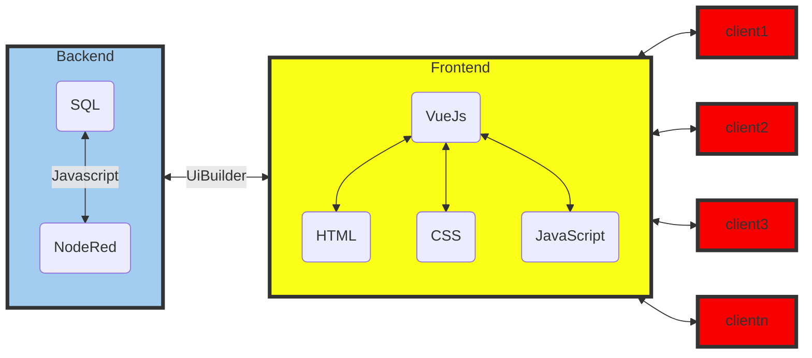

---
order: 3
icon: vuejs fa-brands
title: FrontEnd
date: 2022-06-22
category:
  - Guide
tag:
  - Programmation
  - Uibuilder
  - Javascript
  - Html 
  - CSS
  
article: false

---

```mermaid
flowchart LR
  


subgraph c1 [Backend]
    direction TB
    a1(SQL)<-->|Javascript| a2(NodeRed)
end 

subgraph c2 [Frontend]
    direction TB
    b1(VueJs)<--> b2(HTML)
    b1<--> b3(CSS)
    b1<--> b4(JavaScript)
end 


c1 <-->|UiBuilder| c2[FrontEnd]

c2 <--> client1
c2 <--> client2
c2 <--> client3
c2 <--> clientn

classDef blue fill:#339af0,stroke:#333,stroke-width:4px;
classDef blueLight fill:#a2cdf1,stroke:#333,stroke-width:4px;
classDef red fill:#f90000,stroke:#333,stroke-width:4px;
classDef green fill:#1ee155 ,stroke:#333,stroke-width:4px;
classDef yellow fill:#fbff18,stroke:#333,stroke-width:4px;


 class client1,client2,client3,clientn red
class c1 blueLight

class c5 green
class c6 red
class c2,c3,c4 yellow


```