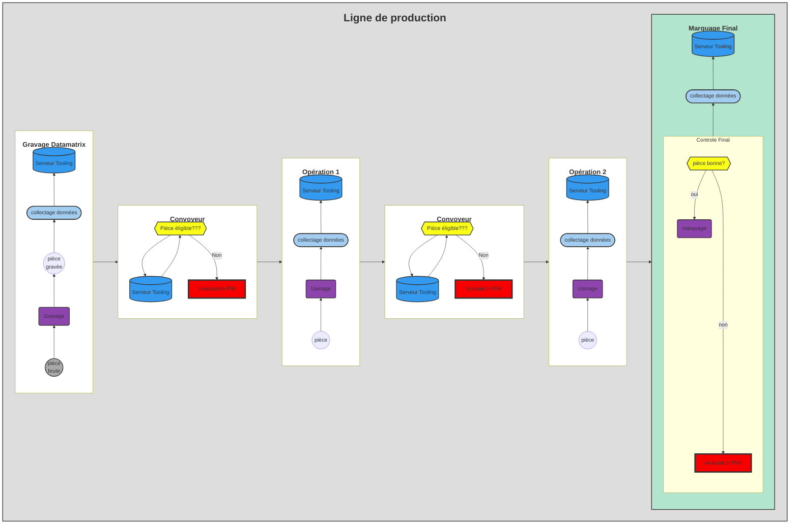

---
index: false
icon: book
title: Guide
category:
  - Guide
tag:
  - Introduction
  - Chiffrage
lastUpdated: true
collapsable: true
---

Ce guide a pour but de vous expliquer les différentes étapes afin d'instrumenter une ligne de production de **A** à **Z**. Bien-sûr, je n'affirme pas que celle-ci est la seule méthode mais je peux vous dire que cette solution a éaté mise en oeuvre sur plusieurs ligne de production sur le site de **Renault Cléon**.

Vous pourrez utiliser l'ensemble des fonctionnalités 
- **Tracabilité pièces**
- **Tracabilité Process**
- **Eligibilité**
- **tableau de bord de suivi**
 
<h1>ou</h1>  

**NE se servir que de certaines**

 Le but est principalement de vous faire découvrir les différentes fonctions afin que vous soyez autonomes et capable de développer de nouvelles fonctions.

Avant toute chose, il faudra passer par la case **investissement** :money_mouth_face: afin de collecter les données machines.

 Ci-dessous le principe complet déployé :point_down:

## Bien Démarrer ...

Pour bien [démarrer](/guide/demarrage), il faudra bien [analyser](/guide/demarrage#analyse) le besoin client pour activer les fonctionnalités souhaitées; Mais aussi bien comprendre, vous devez savoir parfaitement où vous allez en terme de [chiffrage](/guide/demarrage#chiffrage). 
Afin d'être le plus performant, il faudra bien comprendre l'[organisation](/guide/demarrage#Processus-de-Mise-en-Oeuvre) entre les métiers.

## Configuration

Toutes fonctions passe par une bonne configuration

- préparation de l'environnement [serveur](/guide/environnement)
- Configuration des [I.O.T Dizi](/guide/master)

## Programmation

## Formation

## Evolution

[01]: /analyse.jpg
[02]: /guide/dizisoft
[03]: /guide/nodeRed
[04]: /chiffrage.png

[^ftt]:**F**ull **T**rack and **T**race est un projet long terme du Groupe Renault afin de collecter massivement toutes les données machines, les stocker  dans des Entrepôts `DataLake` dont la gestion a été attitré à la société Google <i class="fa-brands fa-google"></i> . La réutilisation des données se fait par requêtes payantes auprès des serveurs Google afin de remonter des synthèses sous forme graphique

[^agile]: La méthodologie Agile est un processus qui permet à l'équipe de gérer un projet en le décomposant en plusieurs étapes. Elle implique une collaboration constante entre les parties prenantes, une amélioration et une itération continues à chaque étape.