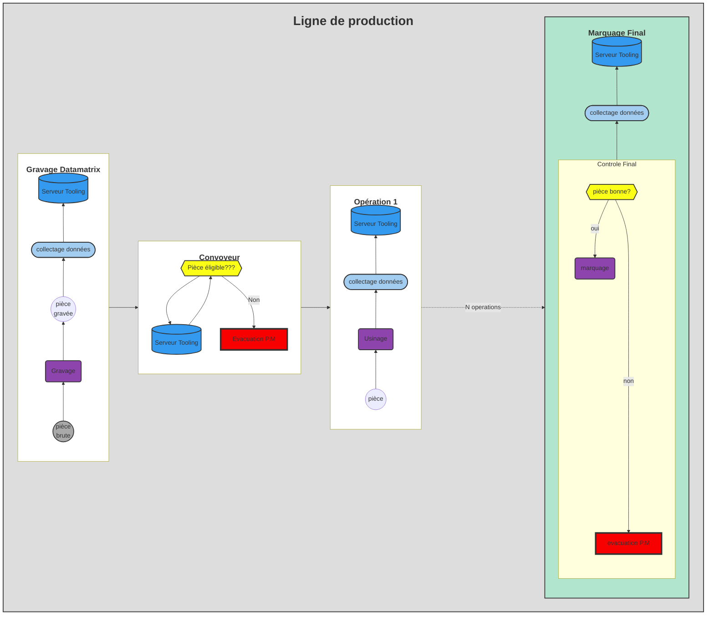

---
index: false
icon: book
title: Guide
date: 2022-05-02
category:
  - Guide
tag:
  - Introduction
  - Chiffrage
lastUpdated: true
collapsable: true
---
:::info Note
Certaines sections de ce guide sont protégées par **mot de passe** car elles contiennent des données sensibles. Vous pouvez contacter [Mr Dugauquier Julien](mailto:julien.dugauquier@renault.com) afin qu'il vous transmette le mot de passe. Je vous remercie par avance de ne pas le divulguer à des gens externes. En plus, il est  prévu le mot de passe sera régulièrement modifié; ce qui veut dire qu'il faudra refaire votre demande.

Merci de votre compréhension

:::

Ce guide a pour but de vous expliquer les différentes étapes de l'instrumentation d'une ligne de production de **A** à **Z**. Bien-sûr, je n'affirme pas que celle-ci est la seule méthode mais je peux vous dire que cette solution a été mise en oeuvre sur plusieurs ligne de production sur le site de **Renault Cléon**. Elle est fonctionnelle depuis 2020 et c'est environ 50 personnes qui l'utilisent au quotidien.

Vous pourrez utiliser l'ensemble des fonctionnalités 
- **Tracabilité pièces**
- **Tracabilité Process**
- **Eligibilité**
- **tableau de bord de suivi**
 
<h1>ou</h1>  

**NE se servir que de certaines**

 Le but est principalement de vous faire découvrir les différentes fonctions afin que vous soyez autonomes et capable de développer de nouvelles fonctions.

Avant toute chose, il faudra passer par la case **investissement** :money_mouth_face: afin de collecter les données machines.

 Ci-dessous le principe complet déployé :point_down:

## Bien Démarrer ...

Pour bien [démarrer](/guide/demarrage), il faudra bien [analyser](/guide/demarrage#analyse) le besoin client pour activer les fonctionnalités souhaitées; Vous devrez savoir parfaitement où vous allez en terme de [chiffrage](/guide/demarrage#chiffrage). 
Et enfin pour gagner en efficacité, il faudra bien comprendre l'[organisation](/guide/demarrage#Processus-de-Mise-en-Oeuvre) entre les métiers.

## :wrench: [Configuration](/guide/configuration) 

Ce chapitre vous permettra de configurer correctement les outils informatiques

## :keyboard:[Programmation](/guide/Programmation)

Nous continuerons ce guide en parlant des différents programmes nécéssaire à l'application. 

## :label: [Pour aller plus loin...](/guide/end)

Je concluerai en vous donnant les outils nécessaires pour améliorer les applications en expliquant les évolutions possibles et la manière pour y arriver. Bien-sûr, je vous laisse approfondir chaque partie en vous listant les liens utiles..

Je vous souhaite une très bonne lecture et j'espère que ce guide vous aidera dans la compréhension de la **digitalisation d'une ligne de production**

