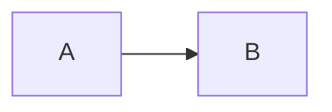

---
index: 1
icon: lightbulb
title: Bien Démarrer
category:
  - Guide
tag:
  - Introduction
  - Chiffrage
lastUpdated: true
---


L'application **`Pilotage de ligne`** a été développée grâce au moteur V8 de [node.js](https://nodejs.org/)

La mise en oeuvre du système d'éligibilité et pilotage de ligne sur les lignes d'usinage nécessite :


## Analyse ✨

L'expression du besoin client est important pour pouvoir :

- répondre à ce besoin
- chiffrer la solution (Qualité / Coût / Délai)


![analyse client][01]

:::info Capitalisation
Pour la solution mise en place sur les lignes Emotor / EPT, le besoin était le suivant: 
  - collecter les données machines
  - collecter les données pièces usinés
  - Historiser en cas de non qualité (`Tracabilité`)
  - Mettre en place des verrous qualités pour assurer une bonne production (`Eligibilité`)
  - Gagner en réactivité et en fiabilité (`Tableaux de Bord`)
:::

La construction des modes de fonctionnement liés à ce besoin devra être consolidé avec les métiers de l'ingénierie, fabrication et Maintenance.

Il sera nécessaire de bien identifier les risques ayant un impact direct sur la mise en oeuvre de la solution. 
>***Pour la petite histoire***, d'autres projets informatique se sont mis en place en même temps que notre solution (cybersécurité, F.T.T[^ftt], Sauvegarde automatique) qui ont nécessité une mise à jour de l'architecture des réseaux, l'achat de matériel supplémentaire et standardisation de données communes à F.T.T[^ftt], intégration de logiciel dans le `Master`du collecteur [Dizisoft][02]


## Chiffrage

:::info Capitalisation E-motor RotorShaft
Le chapitre suivant s'appuie sur les données acquises lors du premier projet **Digital**. Les prix ont été négociés en 2020 et peuvent bien-sûr évoluer...
:::
![chiffrage projet][04]
### <i class="fa-solid fa-user-shield"></i> Compétences & Charges  
Dans l'idéal, il y a deux profils essentiels à la bonne réussite du projet : 

::: warning Pré-Requis
Un serveur a été déployée et disponible auprès du **Tooling Informatique**. Si ce n'est pas le cas, il sera nécessaire de lui en faire la demande. Il peut y avoir un impact sur le Coût Final
:::

  - ==Profil type ***Informatique*** :== \
  Il doit pouvoir appliquer les instructions contenues dans ce **guide**. Il doit avoir des connaissances en `Javascript` pour comprendre et améliorer le système sous [NodeRed][03]. Il participera également à la mise au point des liaisons informatique sur les machines. Il travaillera avec l'automaticien pour activer les `questions d'éligibilité` sur les machines et valider les modes de fonctionnement.

  - ==Profil type ***Automatisme*** :== \
  Il doit connaitre la majorité des `automates` pour modifier le programme afin de collecter les données essentielles à la solution. Il doit maitriser également le logiciel [Diziscop][02]. Il participe à la validation de la qualité des données transmises ainsi qu'aux modes de fonctionnement liées aux `questions d'éligibilité`.

  Il faut compter (par machine):
  
::: chart Charge (Heures) 

```json
{
  "type": "bar",
  "data": {
    "labels": [
      "Prog.Machine",
      "Prog.Diziscop",
      "Prog.Serveur",
      "Schéma",
      "Installation",
      "Validation",
      "Sauvegarde"
    ],
    "datasets": [
      {
        "label": "Automatisme",
        "data": [16, 8, 0, 35, 8, 24,4],
        "fill": true,
        "backgroundColor": "rgba(255, 99, 132, 0.6)",
        "borderColor": "rgb(255, 99, 132)",
        "pointBackgroundColor": "rgb(255, 99, 132)",
        "pointBorderColor": "#fff",
        "pointHoverBackgroundColor": "#fff",
        "pointHoverBorderColor": "rgb(255, 99, 132)"
      },
      {
        "label": "Informatique",
        "data": [0, 8, 24, 0, 8, 35,1],
        "fill": true,
        "backgroundColor": "rgba(54, 162, 235, 0.6)",
        "borderColor": "rgb(54, 162, 235)",
        "pointBackgroundColor": "rgb(54, 162, 235)",
        "pointBorderColor": "#fff",
        "pointHoverBackgroundColor": "#fff",
        "pointHoverBorderColor": "rgb(54, 162, 235)"
      }
    ]
  },
  "options": {
    "elements": {
      "line": {
        "borderWidth": 3
      }
    }
  }
}
```
:::


Ce qui fait un total de **170 heures** en moyenne par machine à lisser sur le nombre de personnes pendant la durée du projet. 


### Coût de la Solution


Les coûts matériels sont  :

::: chart Coût(€) /machine

```json
{
  "type": "polarArea",
  "data": {
    "labels": ["Cablage", "License", "IOT Dizi","Switch", "Serveur"],
    "datasets": [
      {
        "label": "My First Dataset",
        "data": [300, 1000,1500, 150, 200 ],
        "backgroundColor": [
          "rgb(255, 99, 132)",
          "rgb(75, 192, 192)",
          "rgb(255, 205, 86)",
          "rgb(54, 162, 235)",
          "rgb(121, 96, 187)"
        ]
      }
    ]
  }
}
```
:::

:::tip Astuce

Pensez bien à votre configuration Automate. Il est nécessaire d'avoir une carte réseau disponible sur votre configuration pour se connecter au Réseau N2.
:::


## Processus de Mise en Oeuvre

Allez on rentre dans le coeur du métier ==***l'intégration***== et c'est pas le  plus simple...	:anguished:  

**Pourquoi???** \
Tout simplement parcequ'on peut perdre énormément de temps lors de l'intégration.

**Comment Faire???** \
Il important d'avoir une bonne organisation couplée à une communication implaquable. Chaque membre de l'équipe sait ce qu'il doit faire et sait ce qu'il attend de l'autre. L'idéal est que personne attend après l'autre.  	:stuck_out_tongue_winking_eye:

On peut pratiquer la méthode **A**gile[^agile] afin d'avancer dans le bon sens tout en restant motiver  :clap: :muscle:


```flow
st=>start: Début
ao1=>operation: Architecture Automatisme
ao2=>operation: Participation aux M.D.F
ap3=>parallel: Programmes Machines
ao4=>operation: Programmes Dizi
ao5=>operation: Qualité données


io1=>operation: Liste Adresses IPs
io2=>operation: Configuration I.O.T Dizi
ip3=>parallel: Installation I.O.T Dizi
io4=>operation: Validation Réseaux

io5=>operation: Validation Eligibilite
io6=>operation: Validation Tracabilité
io7=>operation: Configuration serveur
io8=>operation: Mise à jour logiciel
cond=>condition: Machines opérationnelles?
pa1=>parallel: Tâches Communes
a1=>parallel: Actions Automatisme
i1=>parallel: Actions Informatique
e=>end: End
st->pa1
pa1(path1,left)->a1
a1(path1,bottom)->ao1->ao2->ap3
ap3(path1,bottom)->ao4(right)->ao5
ap3(path2,right)->io5
pa1(path2,right)->i1
i1(path1,bottom)->io1(right)->io2->ip3
ip3(path1,left)->ao4
ip3(path2,bottom)->io4->io5->io6->e
ip3(path3,right)->io7->io8->e
ao5(bottom)->io6->e
```




